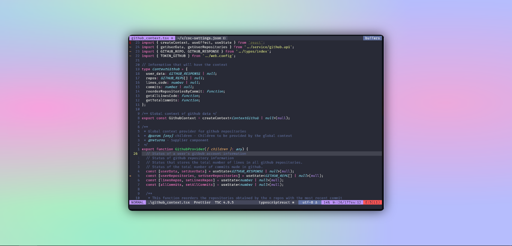

<h1 align="center" >Vim.Config</h1>

Personal vim configuration using vimscript

 
 
 
 
 

  

Vim.Config is a configuration of Vim as an integrated development environment (IDE) designed to boost your productivity and programming efficiency! This repository focuses on providing a seamless and customizable experience for developers who prefer to use Vim as their primary text editor.

## 🔨 Requirements

- [Vim >= 7.0](https://github.com/vim/vim)
- [NerdFonts (Recommended source: FiraCode Nerd Font)](https://www.nerdfonts.com/)
- [NodeJS](https://nodejs.org/en/)
- [Python](https://www.python.org/)

## 🦉 Features

- [x] Multi-language support.
- [x] Multi-language formatting
- [x] Convenient and easy keyboard shortcuts
- [x] Pleasant interface design

## 🎢 Project status

The project is constantly changing because it is my usual code editor and I will be improving and adding things as I see fit.

## 📑 LICENCE

This project is released under the terms of the MIT license. The MIT license allows users to use, copy, modify and distribute the source code of the project with certain restrictions and requirements. For more information on the terms and conditions of the MIT license, please refer to the license file included with this project or visit https://opensource.org/licenses/MIT.

---

   
   

